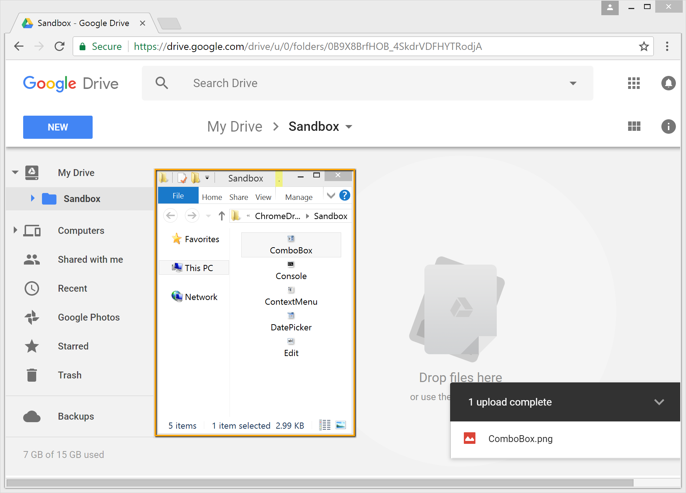

# ChromeDragAndDrop

Drag&Drop files from Windows explorer into Google drive. The test shows how Rapise automates different types of applications (Desktop & Browser) simultaneously and simulates mouse actions.

