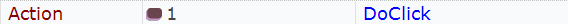
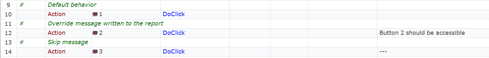
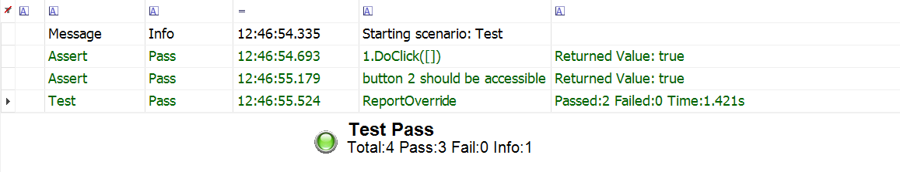

# Customize Rapise Report Messages

Sometimes we need to override the message written to the report when some action is performed.

For example, the following RVL action:

Produces the following line in the report:

Our goal is to have a custom message instead of `1.DoClick([])`.

## Solution
1. Rapise enables one to override its default functionality. For example, one may change the behavior of [Tester.Assert](https://rapisedoc.inflectra.com/Libraries/Tester/#assert) that is used internally by the action to report its status.

2. In RVL one may assign special behaviors to columns **H**, **I** and **J**. For example, here we enable fine control over screenshots via the [custom column](https://github.com/Inflectra/rapise-samples/tree/master/CustomColumnScreenshots). Here we also want to use custom column, to contain corrected message for the assertion.

This solution uses both methods to achieve the desired effect.

## How to Use

1. Copy contents of the [User.js](User.js) into your test's `User.js` or into some common JS file used in your framework.
2. Now if you have something in the colummn **H** it would change the default reporting behavior as follows:

   * If **H** is empty, use default report message
   * If **H** contains some test, use it for reporting
   * If **H** contains `---`, don't echo anything for this action.

So in this case:

The report is the following:

## JavaScript
If you want to override the reporting from JavaScript, use `SetReportMsg("custom message")` just before doing the action. `SetReportMsg` is defined in [User.js](User.js), so you stil need to copy its contents into your project.

## Using Other Custom Columns

Sometimes we use more than one extended column. For example, **H** may contain requirement ID, **I** may control screenshots and **J** the report message. In this case you should change the value of `g_controlColumnForReport` variable from "H" to "J" and merge the body of `OnRVLScriptStep` function defined for each of the columns.

