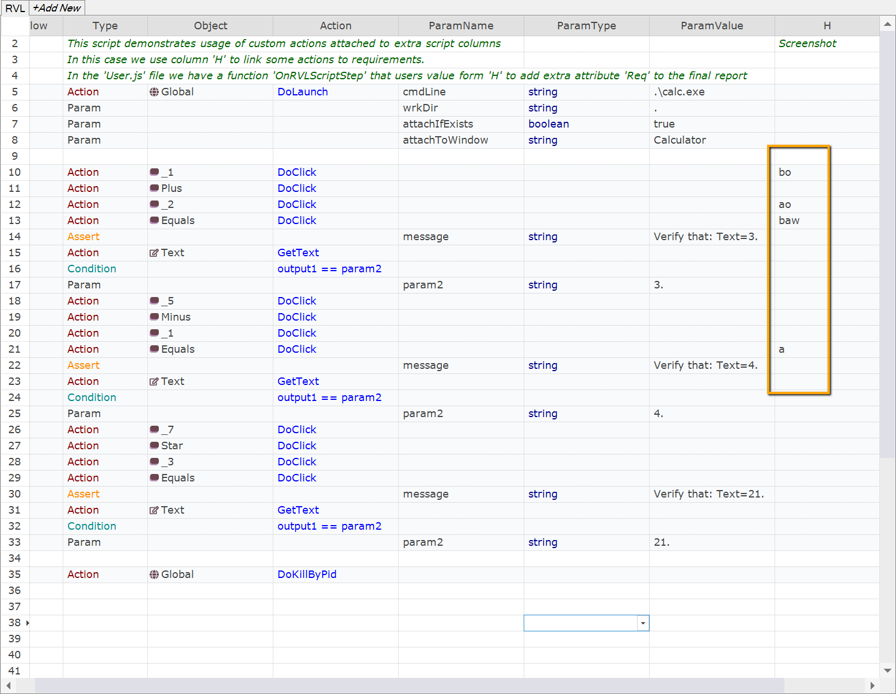
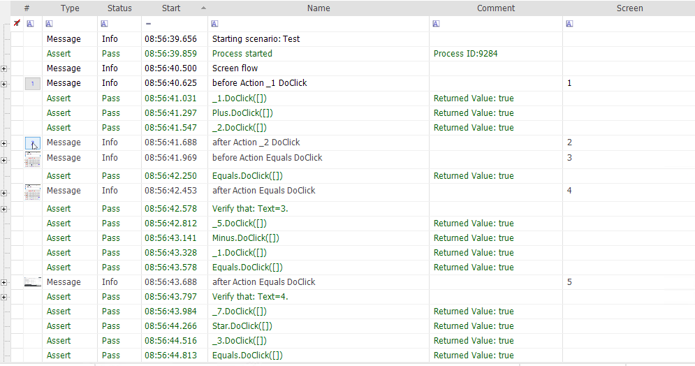

 [Download Now](https://inflectra.github.io/DownGit/#/home?url=https://github.com/Inflectra/rapise-samples/tree/master/CustomColumnScreenshots)

# Using Extra Columns in RVL to Control Screenshots

This Sample demonstrates use of custom columns in RVL.

## How to Enable
You need to copy contents of the [User.js](User.js) file into your project and this will enable the magic for the column H.

## How to Use

Once the function is installed in `User.js` the behavior of the H column is the following:

For each `Action` row contents of H cell is checked.

If H contains character **b** then screenshot is taken *before* the action.
If H contains character **a** then screenshot is taken *after* the action.

In addition to **a** and **b**, you may specify **o** or **w** to control the scope:
**o** means screenshot should be taken from the object used in the `Action`.
**w** means screenshot should contain the whole window containing the object.
Otherwise screenshot uses the whole screen.

In this example we see the following behavior:

1. Row 10. **bo** - capture object-only image before action.
2. Row 12. **ao** - capture object-only image after action.
3. Row 13. **baw** - capture full window image before and after action.
4. Row 21. **a** - capture full screen after an action.

As a result we see that final report contains images at the requested places:

