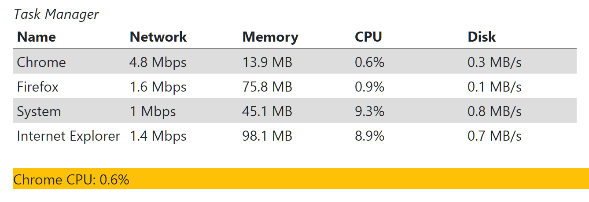

 [Download Now](https://inflectra.github.io/DownGit/#/home?url=https://github.com/Inflectra/rapise-samples/tree/master/DynamicWebTable)

# DynamicWebTable

The test finds a cell in a dynamically generated table and compares it to expected value. We did both RVL and JavaScript implementations of test steps.

This sample uses *HTMLMetaTable* from the LibMetaTable (https://github.com/Inflectra/rapise-powerpack/tree/master/DOMMetaTable).

See the table on [UI Test Automation Playground](http://uitestingplayground.com/dynamictable).

