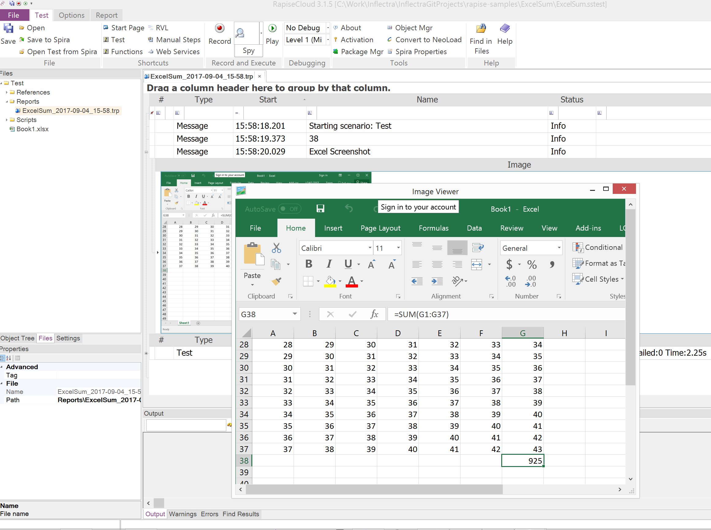

# ExcelSum

This sample demonstrates how to make calculations in Excel and save a screenshot of the result.

## Test Steps
- Open Book1.xlsx from test folder
- Calculate SUM of column G
- Scroll to the SUM value
- Make a screenshot

