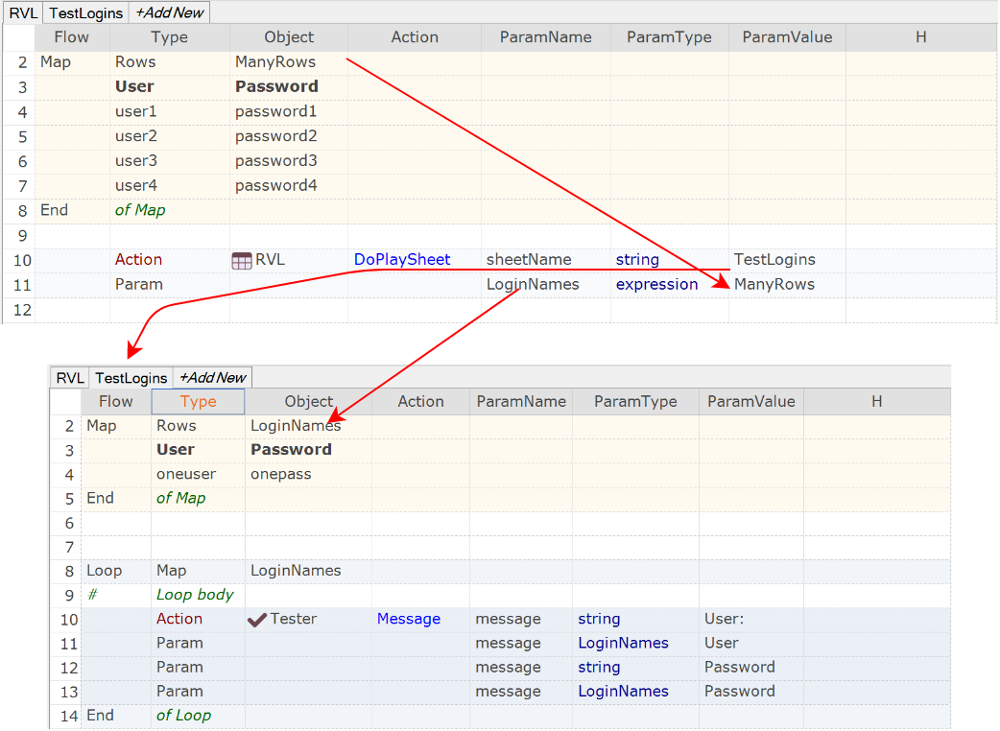

# Passing Map as Parameter

This this sample explains mapping of parameters when you pass a Map as a parameter.

Here we have:

* Source sheet: `srcsheet`
* Destination sheet: `dstsheet`
* Map name on Source Sheet: `srcmap`
* Map name on Destination Sheet: `dstmap`
* Parameter type for passing map should be an **expression**. In general **expression** means **JavaScript** expression. In our case it is just an object name - means an object representing this map for the runtime.

The call syntax would be the following. In the `srcsheet`:

*Flow*|*Type* |*Object*    |*Action*    | *ParamName* |*ParamType* |*ParamValue*
:--  |:--     |:--         |:--         |:--          |:--         |:--
     | Action | RVL     | DoPlaySheet    |  **sheetName**| **string** | `dstsheet` 
     | Param  |            |            |  `dstmap` | **expression**| `srcmap`

Here is how it looks in this example:

In this case the mapping is following:

* Source sheet: `RVL`
* Destination sheet: `TestLogins`
* Map name on Source Sheet: `ManyRows`
* Map name on Destination Sheet: `LoginNames`