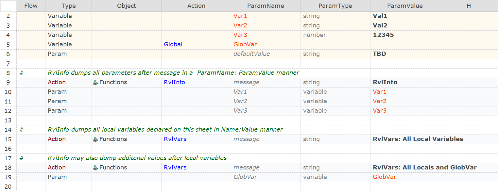

 [Download Now](https://inflectra.github.io/DownGit/#/home?url=https://github.com/Inflectra/rapise-samples/tree/master/RVLVarDump)

# Easy Way to Show Variables in the Report

This sample contains two functions: 

1. `RvlInfo` dump parameters as ParamName: ParamValue pairs

2. `RvlVars` that may be used to dump variables and their values.

May be used from RVL like that:

Get output like that:

## How to Use

Copy functions from [User.js](User.js) into your `User.js`.