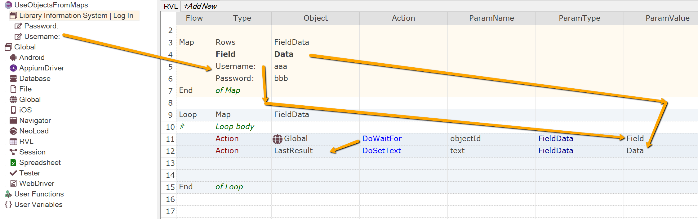

 [Download Now](https://inflectra.github.io/DownGit/#/home?url=https://github.com/Inflectra/rapise-samples/tree/master/UseObjectsFromMaps)

# Refering Object from Map

Sometimes you need to specify object and data for it in the map. Here we will show how to make it using Rapise built in maps and available APIs.

## Map Structure

We have a simple map `FieldData` with 2 columns: `Field` - name of Rapise Object, available in the Object Tree and `Data` - value to put into it using `DoSetText`.

We are using [Global.DoWaitFor]() to find an object. The side effect of `Global.DoWaitFor` is that it returns and object when found. And Rapise may access it via `LastResult`.

Play this test to see it in action.