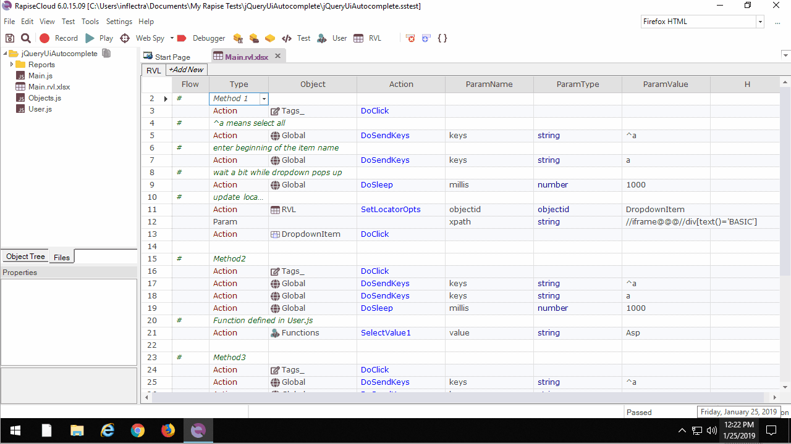

# jQueryUIAutomcomplete

Select a value from autocomplete dropdown.

Open RVL and check out three methods. Each method first clicks on the field, types a character, waits a bit and then proceeds to item selection.

## Method 1

Searching for dropdown item by changing locator of an element we've learned during rcording. RVL version via [SetLocatorOpts](https://www.inflectra.com/Company/Article/rapise-57-released-with-new-data-driven-testing-694.aspx).

## Method 2

Searching for dropdown item by changing locator of an element we've learned during recording. JavaScript version.

## Method 3

Dynamically find dropdown item by XPATH. JavaScript version via Navigator.DOMFindByXPath.

## Playback

